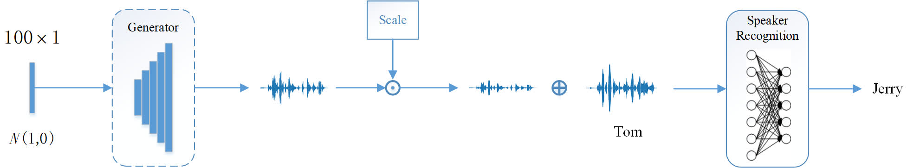

# Universal Adversarial Perturbations Generative Network for Speaker Recognition

<table width="100%" cellpadding="0" cellspacing="0" border='0'>
 <tr><td align="center">

  </td></tr>
</table>
In this paper, we demonstrated the existence of the universal adversarial perturbations~(UAPs) for the speaker recognition systems. We proposed a generative network to learn the mapping from the low-dimensional normal distribution to the UAPs subspace, then synthesize the UAPs to perturbe any input signals to spoof the well-trained speaker recognition model with high probability.
Experimental results on TIMIT and LibriSpeech datasets demonstrate the effectiveness of our model.

# Cite us
If you use this code or part of it, please cite us!  
*Jiguo Li, Xinfeng Zhang, Chuanming Jia, Jizheng Xu, Li Zhang, Yue Wang, Siwei Ma, Wen Gao, "universal adversarial perturbations generative network for speaker recognition"* [arxiv](https://arxiv.org/abs/2004.03428), [IEEE Xplore](https://ieeexplore.ieee.org/document/9102886/).


# Prerequisites
 - linux
 - python 3.5 (not test on other versions)
 - pytorch 1.3+
 - torchaudio 0.3
 - librosa, pysoundfile
 - json, tqdm, logging


## data preparing
### download dataset and pretrained model
 - you can download TIMIT dataset from the offficial site or [here](https://www.kaggle.com/nltkdata/timitcorpus)
 - download the pretrained speaker recognition model from [here](https://bitbucket.org/mravanelli/sincnet_models/) and save the model into ./output/SincNet_TIMIT, this model is released by the author of [SincNet](https://github.com/mravanelli/SincNet).
 - you can download LibriSpeech dataset from [here](http://www.openslr.org/12). you can download our reproducable speaker recognition model for LibriSpeech model from [here](https://drive.google.com/open?id=1AlFfwBY4Y72dJjVCHYAKCq4rry68qJve).
 - you can download the pretrained models for our universal attacker from [here](https://drive.google.com/open?id=1yfFGXOyHMay9q7-0T7s_y0Vddr8s2fo1)

### preprocess the data
prepare the data, split the audio data into slices:
```
python ./common/prepare_dataset.py --type speaker --data_root TIMIT_DATA_ROOT --output_dir TIMIT_DATA_ROOT/processed
```


## training the attacker model
In the project root directory, run
```
python ./train_generator.py --output_dir ./output/timit_generator --no_dist --noise_scale 1 --norm_factor 1000 --norm_clip 0.01 --speaker_factor 1 --wlen 200 --frame_dim 3200 --margin 10 --data_root DATAROOT --dataset timit --mul 0.1 --epoch 50
```
An example of the script:
```
python ./universal_attacker/train_generator.py --output_dir ./output/generator/timit_generator_norm2000_mul01_wlen800_margin10_epoch50_clip001_nolrdecay_fixdmse --speaker_model ./output/SincNet_TIMIT/model_raw.pkl --speaker_cfg ./config/timit_speaker_generator.cfg --noise_scale 1 --norm_factor 2000 --mul 0.1 --norm_clip 0.01 --speaker_factor 1 --wlen 800 --frame_dim 12800 --margin 10 --epoch 50 --data_root /data00/jiguo/dataset/TIMIT_lower --dataset timit --num_workers 8 --test_output ./output/generator/timit_generator_norm2000_mul01_wlen800_margin10_epoch50_clip001_nolrdecay_fixdmse_test --no_dist

```
The training for TIMIT dataset will cost about 2 day on a 1080ti GPU.


# project home page
More results can be found on our [UAPs for speaker recognition](https://smallflyingpig.github.io/UAPs_for_speaker_recognition/main) project main page.

# Acknowledgement
Thanks to the valuable discussion with Jing Lin. Besides, thanks to the open source of [SincNet](https://github.com/mravanelli/SincNet), [Pytorch-Kaldi](https://github.com/mravanelli/pytorch-kaldi), [PESQ](https://github.com/vBaiCai/python-pesq).


Please feel free to contact me (jiguo.li@vipl.ict.ac.cn, jgli@pku.edu.cn) if you have any questions about this project. **Note that this work is only for research. Please do not use it for illegal purposes.**

